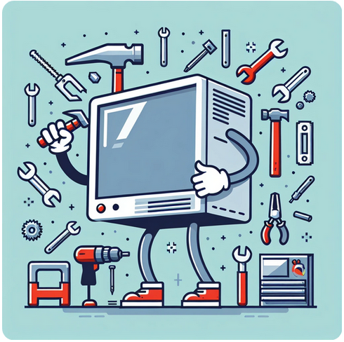

<h1 align="center">Hi 👋, I'm Andrés!</h1>
<h3 align="center">A multi-skilled electronics software engineer from Colombia</h3>

  

- 🔭 I’m currently working on **"Drones For Autonomy" Project**

- 🌱 I’m currently learning **LLMs, Generative AI, DevOps, Distributed Multi-Agent Systems.**

- 👯 I’m looking to collaborate on **Robotics, AI, EdTech and Machine Translation projects**

- 💬 Ask me about **AI, Robotics, Perception, Computer Vision, Machine Translation, Web development.**

- 📫 Reach me at **arciandres@gmail.com**

- ⚡ Fun fact: **I own and ride a backwards bicycle 😄🚴**

<h3 align="left">Connect with me:</h3>

## Languages and Tools:

### Programming Languages

### Robotics, Electronics, AI

<a href="https://www.ros.org/" target="_blank"><img src="data:image/png;base64,iVBORw0KGgoAAAANSUhEUgAAAbQAAABzCAMAAADHcAfMAAAAkFBMVEX///8hLkoIHT8AGj2jpq4YJ0UAGT0fLEmytb4cKkcAFzzW19sVJUQRIkIAFDoSI0JhZ3g1P1cpNE/29/gACjYAEDnw8fPFyM4AADPs7e/R09h7gY/g4uWorLW+wcgvO1Wbn6qGi5hHUGZpcIBJUmeSl6JTW2+BhpNwdobBxMq1ucBka3w7RVxYYHOWmqXd3+PgBeGXAAAVOUlEQVR4nO1d6Xqrug4tEHAgQAZCaOZ5aJvsvP/b3YxtosHIQM9u93fX37oxtmxZkqXll5f/g0dvUP+zO+ynHasz3W+W63HWS6rvJeln4/Vys+9cu/mY1yYjYTfHSW02HvRFTd9OTTNR01FWm9WykewTrug3DHE8jnomHQg/432792I7Cn1lnaF8N7KDdL8bG40mD8fxbpoGduQ+duOl7mGeO8HJrG0Htm3H/iHL66a2vzZ1N5O8pvVFdGkart7Fo3iZvXpmOE2sNV3tall1uyCpb3yv6VsYfuhEi1pFi6T/Zx85IdWNcqPAP7zrRlQPbP/euLvRrqRJ5Nw7cdPFUdc0s4LPpvF+IB1JzSYGoYM6r08/tOPu4k9D2osOx23quYrv0Le7H+Lh8MgOrzYlsC/BOemO7WcYP35h2NRstvlTUzfQbLZZ/PhFfjoWjsVYaI+zme7/iNS2BselF+X2FKabXJWkR7ZJw/wRhTGjz5YOGLrHfs8weG6qYlbvrWPQv1RqJYR2/njbXpY5dHo7TzCX1nnBbrR6Ro/RIXBlA3KDPSEONLsnvc2s1nEXNlUe8+WTV9R9Klub5YRmnXfBsPBuG0f5u+wON50XPUVnsVBkZ/jdFlyGDQc3CzdkV6MIK3p3TzbtWbipr0QDKi00S0WuVBeDr27FmqMM92PvC52hycYzG1AYrZ9/oUVpA3pT7KhVGNeppnNq5p2ZZEjlhXZW260CBl4WyTTjF/y0Zt5NQ5l2Yyln/6jRRinVKGwRnfWJPXn67hXRNFHUivXbkjFVITTLalrGJ84sNdlmN6Q7024yrcnIwbUflAc9RconToU6KTTLJs79CTonL4gl2qQaoVm+zgimsKW/OQ/2xuxgGxhp4C+oePj5Gwda7PEb7m5J72qH0I9z+ji3/whGVZHQLNU1ktouyP9JEs2piSYeeMVkdoK9uO+kKdNghvub0vKN5rjphjaOmkPcFKEqoZ3WpoGZAP0eA4R7udT6nSK68d5R56bUmL9TkmBMHkoSjHzDD8G4KhOa5XfEpv/Q0J57QrQQa8iVsQ3yCNe9Bki47yCExuh8SmgdWge4lH0DUZ3QONcFA/uqRoik/cyK6uAbfPtybHGfscY9khbhqekWN10wO01ialUoNCuYieayrjMOlO+6oXuPwtNwiDkgQDm6F/hhZDuO5zhftwr0t3QvA1rR0+sR4akDfVDZhKsybJJNqf2LAIUW2nmIyED5BbEkpDVCgZ77HIW253YWh4/dsrWY+o4dchNKe6sQS8o+U1Hgtpfr8ftkMqmP17tFx/a4AcWzy++sGTuPGOyM3gLUcc94BwFhkyIAoYXDcU2Hce3PfLeIAnqZhMv8DpM9PUW+F37UHm4Ye43xssPEn5QtcAsbxOJQnjWEN2fH9+E0JmMeN/03IJ1rf0H0eSQXpD8lTuE+eUYoS2JmAaE5oqu43tswtqlt4OVbkFtyMbrdRR1/bjI5dElbggnnPeED/aeKwjE5J0m26yJdGn8qKnKZeWTs7kB9Lu17kRGvSGLxI6GJFM95nDWL6DR/q2XUWvSDDXeTNVo61G5zCCsA/CNeyYFmRnpr9Twe5+tweScMGt+ihxfgtaxs0txtUKu3K7LAiwrtNMwhscG7eaca5Tk1O7peBwtK++cqSHy8BHot0ts+Xkl6jwJu4fXJxRJ2WBRdZnRz7Piks5xRXVFcaKeztIuWVV4U5g+xvIK8cPOcCFOGh5yPQzZfNzdfo7H//DrnSWUkU7jbbzYKgT0UcMDagwc4GY4wtFpGaC8ZOtj8jvYfKCs8X9O9TCK8P3NkMILbU3Tpsb2FvWyg5vvtJ1GoV/6be4vnGe3yOjk5PEfZYoEdd0EpoZ1cLjiXelNkiPVMLLmMG2Cp5VxiQIvapa5HMCaXnBwbbeNkmX7msago0s7SMP3clypytLdJ84ckiGaQv3pvKCc0LAXKj/wEcTMlTIsY4C3qaT91Cz6MT+p4xjFy6ZBLdojtyHXdKLa2Oep80PKcpuuGJ5cw71a/sbSdy6960U6et1FSaAm8MyfvBu/AVq4nuYk4I0Ontq81+8GR5k+lIxpNHeb651gbHjYf84nAkxqNt+em7wJbsD/etjated0kZ6Ok0F5mME+pzYdz+8h0juSXmjW0S7XWIEjKE0WHrhgdviGvuVqUFVoPRqs9fpejez8yVMABRaV0x1QC3EEv13T8TSgrtJcdiAHE7OGRIB8tNUlC7aF/7/JGDzw90xIJeD8PpYU2AYeNzVoWKLAgi9l8om7w/wNg1na/of7g76G00PoOOD1YwxXeWyhlOJML6OJGrHb9v9D0ADdS1IXfBX0YdRTlsDwChdv58DYUWlo2ff1HobzQwBUse/U6hkEbOo6qA0yGcdmECig0/qT9jSgvNJA2xmamwPt1Ayv8jgwWN1C5hxccwabU+vy/DuWFBoIiLhPJ7cONlhao3IA3W2wdEdTF5JXlr0V5oQHvi0snegdWpijtCALet/D2IzxAgwpK3H4MKthpz+rRZULV0J+j8mJyMQJ3jIq9VIDhNWHA+HeggjPt2Tpo0oYITA3hjyMtoH5kL11RAq8tS+H6FajcemRMfrhHCmlHnDzGfi9OlY/NDZ+fivJCA6FZxvuqiwMnWkCrkHUwiAw1b/mveNilhTYCERFGGnDlC/K2SID4NHsVCnf2GVFHklT4C1A+9giWNOPGgjNGRQW/F9ozLrd7qLRrP91UQsjwt1FaaLAky6ENDHAWcd5cLqDR73GmPJ0X7KbLf8D2L32fZkF9RQanoLNLFXeJAONTrOdwZKo8Qm9RxNk4IxllWUNm9CajQSYjZHpJ+uemRiG9skKDOXGMVQgDUIUvJfvAlOeDYUwxxDkB3dsW0JLZspPGQeos5rmhnMFuemoaB/tt7jXeYNg+N433Q4NPKim0HuTaYbYQNOZyk1o5QH+Pz2kecIUeZ1HH+7XZtWhjH9zqQXzb1jsPo1Vw5YxSfuQNtVuofwhueWZ+FMiN25JCW8JKDOaMgSeMeYT/DrCBXL5YjayaueM09dO5fHHX0sdu7bZmzdWfqkYiHYXA21NhUGRLj9tyQqvBy2RFp7i/fDxPtT6TSgsQNdMkEvWZEr/7p/pR2pkPRKsHlkG6HVZqY1B954fs0ngHbonvCC+QSgkNesz8EQMM8ILxkDOA+agLh000CvI2TVHcHubPFM5/d7m1kiHuJN9ivrDxivKzqZo3AmWEtsa5p1yuDSgLF9Xw03gHp2OgsdHmgjrh07kTbvV6qU9UN9p0KKZnYfcwYtybNm7qym6QigutQdAXsSeMVTgNEQJmrWrzrCAlHA3VTKc6u4RIZj8tT/If1mT9ErkmalQxUCpyR4oKbUDWjcWMJd8Di6qwm3bqGMhBn0iwJas4MU52yYabL7pmkzRbE7LimIwkJCQnheyy1rwSNElGk7lP0ieyl1Z90LpguPiMo5nHN/OkVCJuEK1JVTsmq6NVh7DQqfLDE0LiqMro5eRIPBEgNH/V0uOw2avUY3gDWLrCEVAwsiph+qfAvOTphqwjpidUdjQkpndJe+kxofRIRUonsHPl95JkFnhB5bs58HkShyabHHUEhWwlsrShssrdtMkuldM9Rjauc2nTTanpJWyLy68SRzgTsBEl8FbII+LzyacNIDQR8QKNHhRa/tIcrGKpjjytvO4aWPNMQ0oSDHsUJQlGvv8xzRJrhbzgovCgeBpiYi6001kzNRCbPX1eUkwzSmiM2RP+WJolvgwZE8pS54EQSGiabh9Q33tiJenHu8fNxrSi8t8ZupomkYLB0KlIqFiqE5qO76HKnVZAPV7x1nI43iWEaPoQJFjQ/+UQhynDyESlYDDUkIVolooi1h6g8EwrYYggocm9h9E6ilnqpmf49tcXzml6IooEnDEJKcXCTLwos7AaoalUX+R9hPfNxU1+Y+vxCdnOl5HKq69i8DfSuSZj3jQjE+nS0czIypXcnFYiNDdv5pCfZp709flThn4aRO99FwUSuX3SLuBiyDNscpmSJxVtxpPUqiLjsQqhKaed58bD++YKIyIFvIeT3LoB+bbNEz5JeWoEp6jyyDA/GRKhuZMoRibrVXQ1W15okZtfZ9aDRWympWlfQLHHYoZoNpwGBKXMI5RzD4+gakaeSoNgNIuZwRKXtI7s9qOk0FSUbiVauFNZlP8NRvkLJy4M5tNUa0+G91DqKIXiZQmReiHKR+cSz5IObNoU1vaUEZpyvWguSzlqCysP8wGzTewyNZ6NuR9o7Elvdm/nPs9vwHtTx87zXuNYSU7oAx4tW8rOXEJonvoQG4EbcWZHHoBVLWO11CDbuQ6rJl/vP37cf9FYKberUxT9x6CZ39Utz94hfWz6IU2cQUJTDNCAXAl1zR0gMViJCXQQgFPq70tTtfTHbS6k/FBNMrO8pu8r37WDVc4xOu4E57cQfTcKFjlRhPr0s2lb7rtCoXU4oGHZJrY2TAxOC081CDoUTlV+Qrahg1yPblPyvltNp/vWWpDDNRlu2p32YS4wkrJbU5MYkfjmGuXGy+mmXnBmR1o0pz6ZPu/5EqfjE7INyWEOIpuJ/GnZJPmOpleIhYYftOGf4MOA2dyFvesR2LIlEhcAJtRjbuSDTH8d8hyRUlsNclUVtvkn0Leujmsi2RFOdOFU6O+EXGiw0t0sggjrNIpmq6JU5SpJr/DbkGUCbt8Hg2wsFIIz0R0gxdhyCloi4JZeyd5jlKKOorjhTyzVNhDaOz7V5FYqrK6RMp0CJDClpeIzByUjquIJ7N8Hk7xHlNZgQKmSAYnzvGf/xc/wwLHDijuoAiZCQ9x90id+X3DmY8EtAku3S2QI0RihXPyKO6gCJkJLymw1eBMvyspEgPl73cqpa1vQy666gwpglBaOc23lRxPcI4UcrAGwYL+B8gpxWVTeQ3mY5fLDuk+DKBIs4C1k9MMM3sqPNCINoPIeysNMaGPkq4lpiFFtgvw8/EQPxq1LpOKxfUANXHkP5WEmNETDb7DVYEq8lsGf+VgDPvmigMHN3y80oqiKLr4iAANQKjA2ReCSYal3S+AfFFqCspnFGyaBV/uiZNqnb4XKmWV+KQFIjPIPCI14S8uR3rKgp0sdszlP4GmT84RUMSAG2G/ooyxMhZYgU0S8YeD1jLTC+A70MGW+19Azr+1u/HPW4wtVVSw+m1Cmu/CN5Sugj3ayHfNyepJV11QFY1Lzpx+UZxElcuYkg6ZXGAuth7KXxFsNczCKVStVo5z7ulCyb1q2KGX3AbAw4lMFj2Yb77X7au0muVPcr23sU1O1rOc27Y1b0amp+0E/MUvDvFAeb7VX6UUhKiL12+JP/UD3ynkSTxbnQ9ReGS1jeFvr31ya3tC2Lz6LCuN2jl+0DZ1702lOKvXady4BC+V61kz8keZC66OwCENbjAHf7eI5NhDW6F/zyu+S1VXMzb3J5TNMdLrlQmfuw5rx45ZmITQ6DyVCfsCnPZ42b/uB4VR5e6nyLUBJgemBI+G0JDgTD76+yWCGK1dyYjFn3XiTrkFZPjL4r9cI78GzbtaklWY24Llps6JogGxk1xLOYwGh9dClvPh5JhwGO0lNoL7WOA8gp76kt/pyMFR3KNXC6C3F4PyfDfT8L6shRogCI+Rs5B6qJWDJmwCKkL/A9zbludn4cue8anNndEcUoOtz+O+68T7HU9kd+xouqksqNFXrxL26usf5kzazpDe4ViOSRSqKCA35n/KtRlGehLZ+Ro9TIreNLg+740s33uDHEvZiTPZ1KQ6muZPIdUpVRTH1S3RVlCjeUIhmCW01JX6frEXU86l0yW+b3jwgUu31D1M+6sY73HiXI7b+Es/4+bROkOV1+QuZBEhyJ9EJtSsqp1kWfy8kNFjYaZDH2CeLi6KIKZhKZhZZIdLV3eskC6r0WTXtgyY5IZmF+L8ugVWcO3gGuWxo7iSliME1aF5DkU1XjNAM0QnJaoXPYOijotcWemC497brojfrL+COiSv2HLGSG7s0K2cyGAZUTxdtNaSLfWNi42LD+gIqoxZWN9ygf737hmJCw+kv+jPmEfix69uMetFhXh+M+r0k6Y8ak3nL57gIXH2pTI0n51RROl3WBg/LORkNZrtpTDIYXAna9vRHUCXI1GMAzOTARNAbRLdNBakD0cyrUBzbmLIsLG7keNE5bOJHnheRR8mlrygn2jnX0Tyq0PbCzn7zsfxoHfZTK/LskJ5rdS0TYX6HSnVgiv0MaJa4R7GeUFBoR6Tn5Vtt5OfUOuu5h09KK9d+10rt0ofvhqGenu1zrrm//hiaJXHqOnw+xFJyAnCyrl+OVFBlPxQQ4ebhTtDG/JkS2s/eaS9H5O8a5MTlM0JrEIgMVcjvXQB3n8ngTGMIryhNSvk+Fk2jhVCYw/gDdup35OF0TDMuRizMC6mh0JNpR7PbL+3kJJ04VnRtSrgajPVIMW7hsRUVWgMZkI7BC7eYNF2IVJzLk8lp5yh8LQ4DP41mZKL9NPr8E5G8F2cLR1tNWQY3V5ldZEqVjp8QYrQqQbfxsKHxte8ZpG1OMzLRt8SkeyCjfSguNEidI9zadxzbYm7hryE5Zux1W0TaIsUTQducEv4rGU2YkbFHMn5Wp3alNtLziRKPKaBSBe7NEhpJiyxN18A2us48I+vQEZUcuOnTNFD7x6sgyo+bNr8vyn8DzrQx2movL2OXZlJkZlJmNgLMmyZ9XOEtwOIYoPO7yVVqHfELJ1z4po8i4S7FMUigzLMlaKmYFlWMll2p/lLxolhm6mj3anZ6NtMZ+pE60LPRnp3dNyCKsMNGZQfgXHd9YV5bGaFhSsrAtKw8WwSSKfVtqzjZYKPFvSOAoSJnR03y26NSUPFBY3INHh8CUMFKs3ka7cfZd74zR+QLpbfaCe+rOI8y043btVKVFsehz/NfPX6+o6jXFM7oL7uXqKil3CDUL6DesGvfmjqe3g1K5um9qZ1CankeNc9/hNlWyVIfIC1ATpztUocNDp822esmP9MwD736qmvznVxnuLuqa7bFaL23IjvstAQJa38Wl6abcX6K5OzctNnZ1AzyHsed9iM6ZuTCrWkboFBpZq9+8IMIxdqVGwXhqlaGG/AB/fHGogP6ym06XudQz+2oNzqOhOvne5r+MPSyeWuaxo5tR81mM7JtJ047h/lbRRK7dTKY7RZRGjh2dMWpmyANpoftuPE7p+3vI+k1JuPaej6fr2vj94GcPMysl372Pp79OWN26iYb5fTzP54LaAiRGyfRAAAAAElFTkSuQmCC" width="110" height="30"  style="margin: 00px 5px 10px 1px;"/></a>

### Development tools, IDEs, DevOps

### Software and web development

### Design, Modeling, Prototype

<a href="https://www.autodesk.it/products/inventor/overview"><img src="data:image/png;base64,iVBORw0KGgoAAAANSUhEUgAAAOAAAADgCAMAAAAt85rTAAABU1BMVEX////brwZvWQPrzV1vWgD///v//v1xWgD//f57Zhv///ljTgBuWgXDv55tWwDergbty2DbtCCCYQHuzljs5Z/oz1vm3ZfTrADfrwByVwtoVACzlA3//vbLrQDSry3/+//88dn8+9z39uf17snx7L7iqg2qnG3Rti7WwGb///H//+zXtABjUgDWqgD79/B4bC1aRwCFd0PQsj3MtAD8/Nn88tRtTwBaUADi2Ivm3KDYu1X156nizH7t3a7i13zi01fv0pnq0kTvy2n//cvk0W/jz4zewXD459bny3H585Per0F8ajGAdjbRsjd6aAT//9Hu43vGphPz4r7uy0e3mSC6oUmJchmokDb2xWi9uKeqoYGOhU9rYBizrICAcEFnVBXPx6KYjGbh28HGwp58b07c1MG6soK5sIrPxbdvaDDk3dW1q5qspoKTjVPUy52KhViuoWzGTi2sAAALoklEQVR4nO2d+1fbRhbHZaEZTUeyZNYhthUZ+YFJJYQxSbDjNiRtSh5bp82SbttNYoIxG2i2NOn//9PeOzIB9ixBNJZsc+Z7augRxPJHd+Y+RheNokhJSUlJSUlJSUlJSUlJSUlJSUlJSUmB6KQ/QMKihHPOPI9yytISJURRvLQA8QVfCIdvaUkR50sFD8/FFAJmxFc6Yh51XcpSAYShAkPG8xiMz1ROiIKrmtrEh3HiMdevXr/b7V5PS3evbXge8VOBBEDGg82F2yurhduF1LT91ddVN1kySmFgcpcojG507+Xm7YadsVNSwy6ulO9VGXwGnthgpQRDA1FIbfNxPp+fB7pMarLtYqG84BLiuYwkBAij0+ee5y7df/Ag9zBlQFRhuxsQj9CkogU6Te4/+ebpwrffpg24spLJrGYKt74DB8eTAsSwEHS35nKgubkJWDBTLF9ThJdLRsQNXjzaevBTPvcwdcCinSmsZOzMXbjOblLhl1a6uXz+4dwCKpcuILhRGKWNxmPIM/g4U1LIICBtQbflVjbRbnOohbm5lAEz4lS2/SUMpLGm3JjGcw4ZBK3fX5g7rUnMwczq+AExh3eZW7++tXAGMG0LRhq7BUWBwlhtc+sBRIarCOhCoek+ub+FgWHuCgKCf/GfP3qaz0Pou5JDVPHo0v05wIPc80pakDN6LZ876z6vHOCcBJSAElACTi2gjUXAp35N/Dj2hbIfi2XLKQO0G4Bxngqrtl2My5cpggV97kaLweNYe/r8IVosQBUHjOfKFpchHp+NFqRMiW5XjIFvLHMQatVyYfU8Fcq34aexAb9snmh6AOf/vlQ/T082lpa+/r4RDzBTvLG21uutCT2bEkC7WPzhzvlngGze/+7mSjw+277hmCXVQjk/TgegnSlmfghg4lBKmfhy/Ir+B51icCseHwyGG6VSu6QKfTEdgIh4s3q+Q+CEkdrNuHGieMPRS5apadq0ANoSUAJKwIkCZj4JCMkWp4wEswyImeatwIvE2alOCc4VlxJ+mTAxjYAY6BefR1Tc9RAwMicj3KMAzSDQL8YM9FMJiKnaP66hrnd9iO4fAT3a7D663t283r37/QwPUZFsF1axbGgsBtGkiwCZu1QulFdWbt8ux022pxJQlEtRs8JilQi3Gb2369e3i1GxG3tpYPoARcFrjwrem3c43u4YFaqcbGxDLYxuKHbFO52AmeNuk8U7LgCeNGRtlHHJoog/mlnAM1rETh7ysRQnlXLxku8gASWgBJSAElACSkAJKAEloASUgBJQAkpACSgBJaAElIASUAJKQAkoASWgBJxiwLM3QBHwuAlBIaQ+ugFanOEboGd6tm9W+WlAurFdXF1dtYuzfAsbTJRpNOCTFcFQ2IRw0ifDSH27mJn1JgT89I1GebXRsFcbizUKgOxjG0l9u1Auz3wbSdSzLVR3PYUfAyquT1+gsGd7lgGxZ/u5y10UPwPIRf8ao+T5LLdyYc/2LX/UjAdsHwEBDBhd7GKrzXQz3kX9ojPeTnnlG2IloASccsBMHMBZdjIYJuxbwfmP9MOzzHaYuOiPs6h7BXq2R6na/9Psp2oX/4HkjCfb0Z+4ni9xDWYX8MI/UkYDz3LBO1qyKJ6rzIp9dXq2P18SUAJKQAkoASWgBJSAElACSkAJKAEloAT8PMDJPKU5RcD8T/OFTPxn9o1LN9RSSdOSBRTP+s3N5W/Oz2cy8ynrn45p6nqygNHTfrd+/tsk9KNlWakAfvWLYcJJRo84S02mlQIg6ldDnMpMXwioJguYy/2sO6qqiwtppSvgUrUEnMyIMHpa+le/tHXVRMCIMU3peqmkJgAY+ZXcv8CWuV+NRCaXqY0MFEdjB8yJXVDy+YUtMToT0OW8VRKA6D637l4z4FonQiiG/MQAo+h+bzOoGpqVBCBMLg1n9KQAcXDe624w1gy1ZAwYOcm4vz1+QDDfEu6OVwv1WLPFOJGjap86GMkxWnAUXmkDKorXBbyFrc2A4t42ABjHguvZly+zkV697hsOjL6S1YeDeBReO8tvgBEOqhZ81Yzdvd8qQRDUhtnXHQvSad3CMJQOIOkuLDx9tOTjjooIqMbw5c6ycrJPaHBn0GsLQP/4PanvB/XlFgY1q6SrreWKq0Q9MySorxuldnqAlAfdrftL1POwiTwuoLFMcAtG0ejjwYUJXhmWavabSrRnqMcU3EtwuAtZJZjLyPr4JDLkc7ni+cuGrsFJUrIg9Ze6VSbwoiEaz4IU9xET+5LixqTM3QtVdQ0BFXyUO0V+hQ5CTS/pxiEf7Q3E8RweC/ZCKzVABlfaBT7u+5cEBL7acDisBASRKqGm9ijuWtZ8ub8/uIOjlfl7UJ47z3ywseJvHH7YyzZxe0Ov2ceE+lMxY4yATHxUzsUTCS9lQYUPWkars+wz3Oz1taP3mvgs0Rq4yk6/LjaCHcDI7bxniu8qw12j5LT+HfjY4rwTmlgxpAFIsaeaBAr2W8efgyPA94auW623jHOmHBgA6AJWFVyqGe5ReD/2BMZiP/AUn9M3YExd7fzpwuwMhoaASANwhBl9u9wcpOxtaJkWTjHiKQchzkHis1poQXB4p8BgVGodrb1HGGes3hLvqpkBth/6uzrkEymFiVO6HKCrDAwIdOEhxSt0YCAggwmGpgJARoQF20eEuUzJRhFea1XwPHwdUNOKg38Z0BeAunOo4OQ9NNQebi/Amhj1rTdiy7FhqLWPKHOVU4AYMMi6qk8/IFfeijk49NCCESDxMRcCjn2A8jhcgfbO/wAqEeAMWJCz31ph2Pnge7hhNnjRtSbhgdJ813vzJhvgbsUBHHSOIEpSZX8GAQP2n52j34fgFsGL1uBfwRyEicmqQeArDP0WGBABPYCdRUAXpiGnnEA8cPkrzGRELsqEU4Zj/gDz6vYRJGjHTkbTARDjLQJ+6gRTAciPN3VnzWAnhOC3Fog3gQQO0zgf8tMIkMIgzrZ1LCsiQAJe1Jr+MMFJtO05c4frIVRFESD1N+pQO3iMvmxhgYtDFOZg1hBLZnprA/fCRQta2rQDQlYGuehwcASlH+SVI0BSbbXeVTkUFEHP0TQz3IE5SAAQ8msA7FTxb5j5mxkAhM+ZbYUdEH7yU4Ah1A9QXVJ30AIG5w8XnJAybJli0bAfELgywS7kAta0AyoEyqFoOVrDdWIEhEFb7ehav0ohJPo9iPmqVfOIq/jroQkXorXjow8agns1pxhQc5ah5lN8SLY1s4SLuia6DACEgFADwDCrQAGmDFolGJRvPQiZfHM3dIz2elXUhkdGG1eCpxVQs8JljoEOU7XRQpllldq96iiT0a1+xWOuR7PPLN1ZC6BScf3K73uvBj7m6JDNXXgJJwuohcviefaDUC1px4B6qReMlq10tbWPO08w93lfVWFGotVgVlKsdj0v+HAR38SHKFrwLKAYoj44HtbEhUerUwVASNZ2HdVpHQQuxD4MK3CIVf4Ip9yCqhr+6RPiEwTUPwJafYDyacWBg1r4OsAt2qp9CJBW+GFDbLiBCzXB0rPw4oXJCQOa1rODw8ODw2XrIyD+my8OsnBwR+QoVtgbVGqV95aGTjZsfdivV6vVjbeHz1pWjBsxSQHyeICWZRqG0W4b1skcxOYIxzBCwxB3hiGJMZwwhOpeBHj8Ucey8IBpOhev4CcFCCE4zsq2KbIuXdhtBIjfdBHwVUEnfgPvY5ZMkcHAb2MsEcmbNjFAyhTIQy48ewqSgH8ZMObNl6SVIGB/0mxCCQFCeuKvq8nco7+ckgIUq9WThkMlNUThVem1SyURAybQ5XQiKJWTAARC94UBcU7VBeUEBbVyAkMUF1nct32s0SfMh0oGEFTf64ShMWk5LXPsgMd3mdzK4P3BfnaC2gdls+MHRCPichKB2g3+m5zwEVhj3dT8FCChYjF3LDttf5am4CNISUlJSUlJSUlJSUlJSUlJSUlJSUlJSUmd1X8Bg7G/erzUXZYAAAAASUVORK5CYII=" width="60" height="60" style="margin: -6px;">
</a>

<!--
<h3 align="left">Languages and Tools:</h3>

     
     
     
     
     
     
     
     
     
     
     
     
     
     
     
     
     
     
     
     
     
     
     
     
     
     
     
     
     
     
     
     
     
     
     
     
     
     
     
     
     
      

 -->

### Some stats

&nbsp;

  

<!--
**ArciAndres/ArciAndres** is a ✨ _special_ ✨ repository because its `README.md` (this file) appears on your GitHub profile.

Here are some ideas to get you started:

- 🔭 I’m currently working on ...
- 🌱 I’m currently learning ...
- 👯 I’m looking to collaborate on ...
- 🤔 I’m looking for help with ...
- 💬 Ask me about ...
- 📫 How to reach me: ...
- 😄 Pronouns: ...
- ⚡ Fun fact: ...
-->
